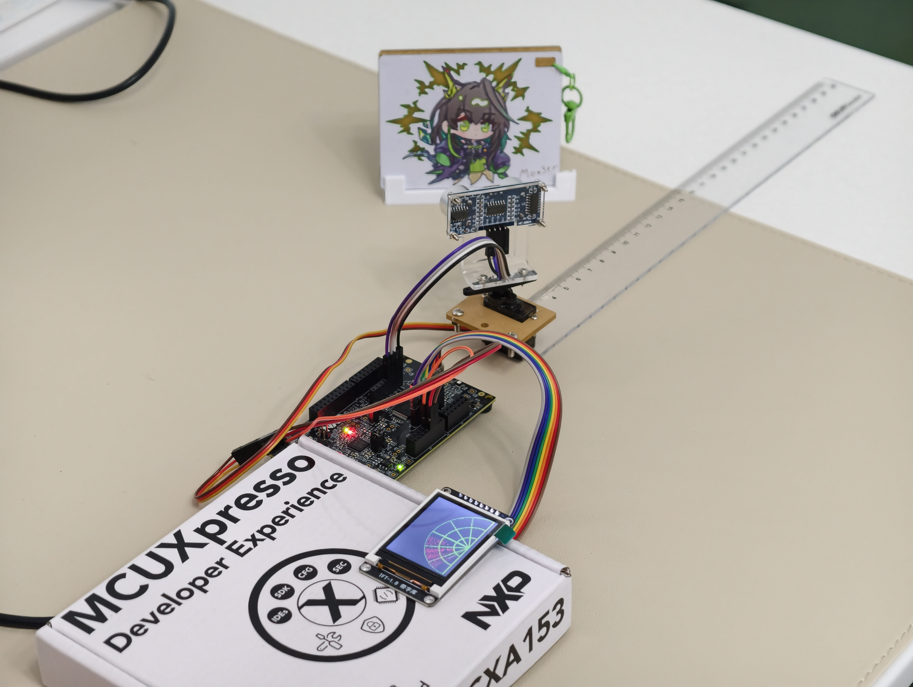
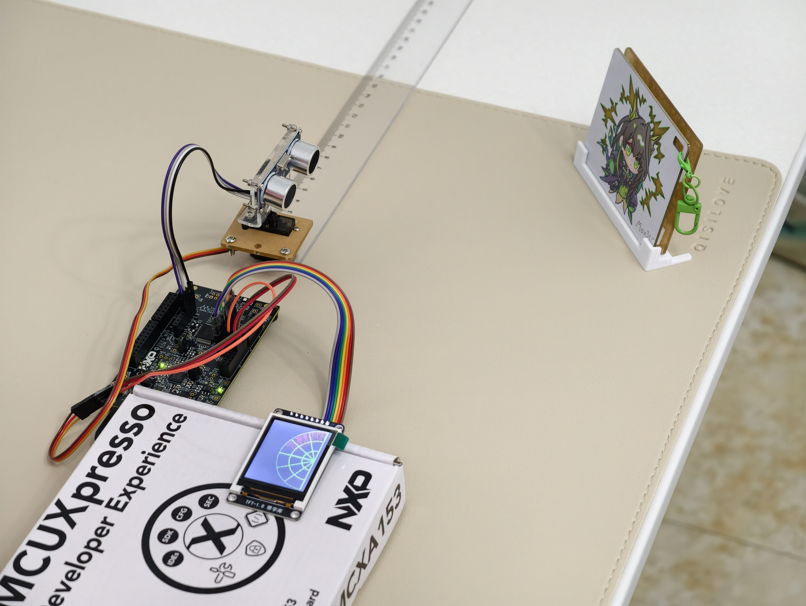

# Zephyr 超声波雷达扫描系统

**[English](README_EN.md) | 中文**

基于 **NXP FRDM-MCXA153** 开发板与 **Zephyr RTOS v4.4.0** 的超声波雷达系统：MG90S/SG90 舵机驮着 HC-SR04 超声波探头在 180° 范围内往返扫描，每个角度测一次距离，1.8 寸 ST7735 屏实时绘制极坐标雷达画面；每扫完一轮，片上算法把相邻回波聚类成"目标"，估算出方位、距离和宽度——全程运行在一块只有 **32 KB SRAM** 的 Cortex-M33 上，无帧缓冲。





## 功能特性

- 舵机 180° 往返扫描，1° 步进，18 ms/步，50 Hz PWM（500–2500 µs 脉宽映射）
- HC-SR04 双边沿 GPIO 中断捕获回波脉宽，输出毫米级距离（有效量程 20 mm – 4 m）
- ST7735 160×128 雷达 GUI：静态网格底图、实时扫描线、目标点保持、红色遮挡线（余辉效果）
- 目标检测：每帧结束对角度样本做连续性聚类，余弦定理估算目标宽度（含 8° 波束角补偿）
- SW2 循环切换量程 30 / 60 / 100 / 200 cm；SW3 暂停/继续扫描（50 ms 消抖）
- 板载 P3T1755DP 温度传感器（I3C），每 5 秒串口输出一次
- 串口遥测：每秒输出 `angle= xx deg  dist= xxx mm`，帧末输出目标报告
- 无帧缓冲设计：静态底图用解析几何 + Q15 定点查表现场恢复，整机 RAM 占用约 16 KB

## 硬件概览

| 模块 | 连接 |
| :--- | :--- |
| HC-SR04 Trig | P3_28（GPIO 输出，12 µs 触发脉冲） |
| HC-SR04 Echo | P3_27（GPIO 输入，下拉，双边沿中断） |
| 舵机 PWM | P3_9（FlexPWM0 SM1 B1，50 Hz） |
| ST7735 SPI（SCK/MOSI/MISO） | P1_1 / P1_0 / P1_2（LPSPI0） |
| **共享片选** | **P1_3**——低电平选 ST7735，高电平经反相器选 GT20L 字库 |
| LCD DC / 背光 | P3_30 / P3_1 |
| 量程按键（SW2） | P3_29（板载） |
| 暂停按键（SW3） | P1_7（板载） |
| 温度传感器 | 板载 P3T1755DP，I3C 地址 0x48 |

> 完整接线表与实物图见 [docs/wiring.md](docs/wiring.md)；软件架构（线程模型、状态机、内存优化）见 [docs/architecture.md](docs/architecture.md)。

### ⚠️ 硬件注意事项

- HC-SR04 的 Echo 输出 **5 V 电平**——接 P3_27 之前必须电阻分压/电平转换，或改用 3.3 V 兼容的 HC-SR04P。这不是软件能解决的问题。
- 舵机必须**外部 5 V 独立供电并与板卡共地**——舵机启动/堵转电流足以把 MCU 拉复位。

## 快速上手

环境要求：Python 3.10+、CMake 3.20.5+、Ninja、Zephyr SDK 0.16+（或 Arm GNU 工具链）。

```bash
# 1. 准备 Python 环境并安装 west（Zephyr 的构建/依赖管理工具）
python -m venv .venv
source .venv/Scripts/activate        # PowerShell: .venv\Scripts\Activate.ps1
pip install -U west

# 2. 以本仓库为 manifest 创建工作区（Zephyr v4.4.0 及 hal_nxp 等拉到 external/）
west init -m https://github.com/Tomimi-HCH/zephyr-ultrasonic-radar-scanner.git radar-workspace
cd radar-workspace/zephyr-ultrasonic-radar-scanner
west update
west zephyr-export
pip install -r external/zephyr/scripts/requirements.txt

# 3. 编译并烧录（Windows 推荐 NXP LinkServer；pyOCD 无法驱动板载 MCU-Link 探针）
west build -b frdm_mcxa153 -p auto
west flash -r linkserver
```

串口参数：`115200 8-N-1`。

> 工作区已初始化过就不要重复 `west init`，依赖有变动时执行 `west update` 即可。

## 运行后该看到什么

**屏幕上**：黑底半圆雷达扇面——深绿网格（3 圈距离环 + 7 根辐条）、亮绿扫描线跟随舵机实时转动；某个角度扫到物体时，从物体距离到量程边缘画出一条红色遮挡线，并随重扫更新。

**串口里**：

```text
[00:00:12.345] <inf> app: angle= 45 deg  dist= 512 mm
[00:00:12.381] <inf> app: angle= 46 deg  dist=  -- (no echo)
[00:00:15.000] <inf> app: Ambient temperature: 26.3 C
[00:00:20.107] <inf> app: object #0: 40-52 deg  L=18.4cm  D=51cm
```

按 SW2 切换量程、按 SW3 暂停/继续，均有对应日志。如果上电后日志停在某个初始化步骤并打印 `<err>`，按提示检查对应硬件连接。

**若花屏**：overlay 已内置 `inversion-on;` 并把 SPI 限到 8 MHz；仍花屏请缩短 SPI 飞线，或在 SCK/MOSI 上串约 33 Ω 电阻。

## 仓库结构

```
├── west.yml                  # West manifest：Zephyr v4.4.0 + hal_nxp, cmsis_6, picolibc, segger
├── CMakeLists.txt / prj.conf # 构建脚本与 Kconfig（内存/外设/日志配置）
├── boards/frdm_mcxa153.overlay  # 设备树 overlay：全部引脚/外设配置都在这里
├── src/
│   ├── main.c                # 设备初始化、舵机/超声波线程、消息队列、系统协调
│   ├── gui_radar.c           # 极坐标雷达渲染（无帧缓冲）
│   ├── algo_object_detect.c  # 角度聚类 + 目标尺寸估算
│   └── font_chip.c           # GT20L 字库驱动（保留在树中，默认不参与编译）
└── docs/                     # architecture.md、wiring.md、images/
```

> 字库驱动自 2026-09 起有意移出编译（共享片选时序干扰排查期间停用）。恢复方法：在 `CMakeLists.txt` 的 `target_sources` 中加回 `src/font_chip.c`，并恢复 `main.c` 中的字库调用。

## 许可证

Apache-2.0，见 [LICENSE](LICENSE)。

## 致谢

- 感谢 [DigiKey](https://www.digikey.com/) 活动与 NXP FRDM-MCXA153 开发板；
- 测试中使用的雷达挡板来自立创开源硬件平台博主 [aknice](https://oshwhub.com/aknice) 的[开源设计](https://oshwhub.com/aknice/project_wjjeuibp)；
- 感谢 Zephyr 社区——设备树与驱动模型让这个项目没有写一行显示屏/传感器驱动。
