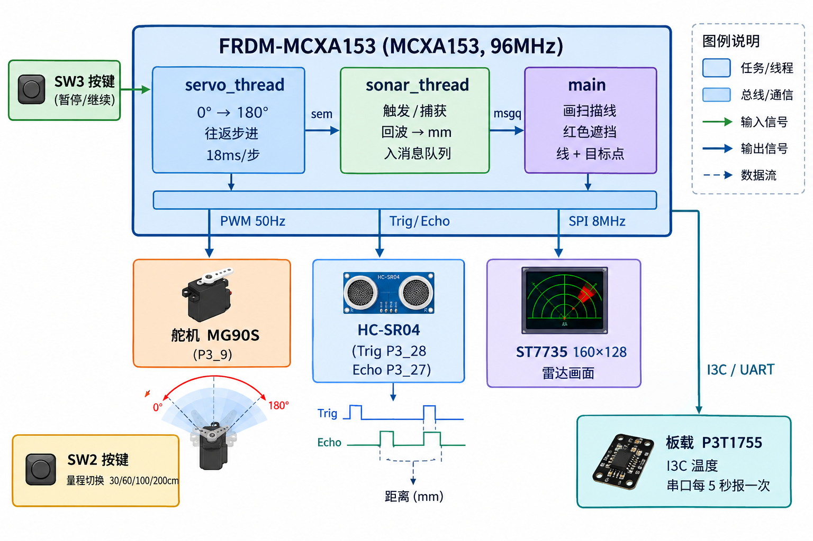
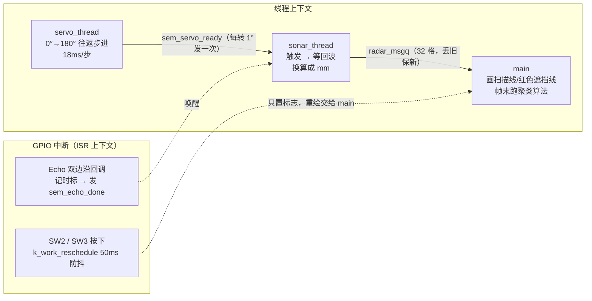
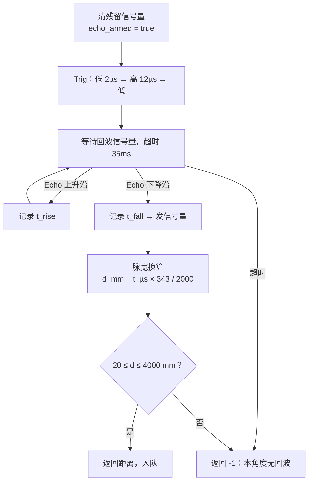
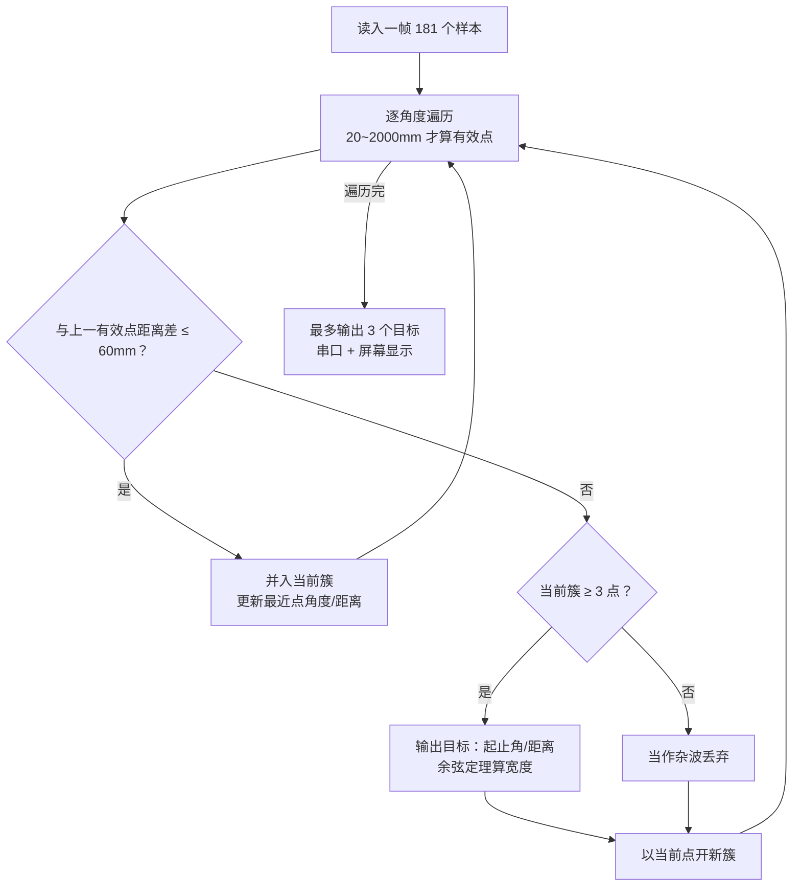

# 软件架构

本文介绍雷达固件的软件设计：任务拓扑、同步机制、测距状态机、目标检测算法，以及让整套系统塞进 32 KB SRAM 的内存优化手段。

系统总体框图（点击放大）：

## 任务拓扑

固件包含 3 个应用线程（优先级均为 5）和 2 组 GPIO 中断：

核心思想是**把"转、测、画"三条时间线解耦**：

- `servo_thread` 是节拍器：每转 1° 只做两件事——更新角度、`k_sem_give(&sem_servo_ready)`；
- `sonar_thread` 是生产者：被信号量唤醒才触发测距，保证**每个样本都对应一个确定的机械角度**（不会"边转边测"引入误差），测完塞进消息队列；
- `main` 是消费者：从队列取样本画扫描线和回波，帧末（180°）跑一次目标检测并输出串口报告。采样永远不画面，画面永远不等采样。

两个同步细节：

- **队列满时丢旧保新**：`put_latest_sample()` 在 `k_msgq_put` 失败时先取走最旧样本再放入最新样本——宁可画面丢点，也不让采样被慢速的 SPI 刷屏卡住，生产者永不阻塞。
- **样本携带 `frame_id`**：帧切换时扫描缓冲重置为 `-1`（无效），被丢弃的样本不会被聚类算法误当成真实回波。

按键（SW2/SW3）的 ISR 只调度一个 50 ms 延时工作项，状态翻转和日志都在线程上下文完成。

## 测距状态机：GPIO 双边沿中断捕获回波

HC-SR04 的 Echo 高电平脉宽等于声波往返时间。Echo 配置为双边沿中断，上升沿/下降沿各记录一次内核时标：

- `echo_armed` 标志屏蔽测量窗口之外的杂散边沿：上一次超时测量的"迟到回波"不会污染下一次测量；
- 回波脉宽最长约 23 ms（4 m 量程），等待超时设为 35 ms；
- 时标差做了 32 位计数器回绕处理；换算 `d(mm) = t(µs) × 343 / 2000`（声速 343 m/s、往返除 2）；
- 有效距离窗口 20 – 4000 mm，窗外一律按无回波处理。

## 32 KB SRAM 怎么装下雷达画面

160×128 RGB565 的显存副本要 40 KB——比全部 SRAM 还大，所以**不存位图**：

- **画不用算**：0°~180° 的 sin/cos 做成 Q15 定点查表（`sin_lut_q15[181]` / `cos_lut_q15[181]`），极坐标转像素全程整数运算，没有一次 `sinf()`；
- **擦不用存**：擦扫描线需要还原底下的网格，`static_pixel_is_set()` 用解析几何现场判断像素是否属于静态帧——圆环看到圆心的平方距离，辐条看叉积（垂直距离）+ 点积（投影范围），逐像素重画，省约 2.5 KB RAM；
- **只重绘被覆盖的像素**，从不整帧刷新静态底图；
- `CONFIG_HEAP_MEM_POOL_SIZE=2048`：应用从不调用 `k_malloc`，Zephyr 默认堆在这里纯属浪费；
- 目标检测和串口报告**每帧只跑一次**（在 180° 帧末），不按样本跑。

"红色遮挡线"的余辉效果由 `shadow_dist_mm[181]` 数组实现：每个角度记录最近一次遮挡距离，扫到就擦旧画新，没回波就擦掉。

最终内存占用：**Flash 70.2 KB / 128 KB（55%），RAM 16.3 KB / 24 KB 可用（66%）**。

## 目标检测：连续性聚类 + 余弦定理估宽

每帧 181 个样本扫完后，main 线程跑一次聚类（`algo_object_detect.c`）：

- 判定规则：**相邻角度距离突变超过 60 mm 视为两个物体**；少于 3 个点的簇视为杂波丢弃；
- 宽度用余弦定理由簇两端的距离和夹角算出，并扣除超声波波束本身的扩散角（`beam_comp`，8°）——否则测出的"宽度"会把波束角算进去；
- 每帧最多输出 3 个目标，经串口报告（`object #N: a-b deg  L=xx.xcm  D=xxcm`）。

## 共享片选（CS）的软件配合

LCD 模组上 ST7735 与 GT20L 字库 ROM 共用一根物理片选 P1_3（经反相器拆分）：**低电平选屏、高电平选字库**。软件配合方式：

- 显示屏驱动走 Zephyr 标准流程，overlay 里 `cs-gpios = <&gpio1 3 GPIO_ACTIVE_LOW>`，由驱动自动控制；
- `font_chip.c` 的 `spi_config` **故意留空 `.cs`**，每次读 ROM 前后手动翻转 P1_3，整个 `0x03 + 24 位地址 + N 字节`事务期间保持选中，所有错误路径都会把线恢复到 LCD 安全态（低）。

> 字库驱动目前保留在源码树中但不参与编译（共享 CS 时序干扰排查期间停用），详见 README「仓库结构」一节。电气层面的说明见 [wiring.md](wiring.md)。

## Kconfig 关键配置（`prj.conf`）

| 配置 | 作用 |
| :--- | :--- |
| `CONFIG_GPIO=y` / `PWM` / `SPI` | 三类外设驱动 |
| `CONFIG_DISPLAY=y` + `CONFIG_ST7735R=y` | 显示子系统 + ST7735 驱动（Zephyr 自带） |
| `CONFIG_SENSOR=y` + `CONFIG_P3T1755=y` + `CONFIG_I3C=y` | 板载温度传感器（I3C 总线） |
| `CONFIG_FPU=y` / `CONFIG_CBPRINTF_FP_SUPPORT=y` | 余弦定理估宽用 `cosf`/`sqrtf`；日志打印 `%f` |
| `CONFIG_LOG=y` + `CONFIG_LOG_MODE_IMMEDIATE=y` | 日志立即模式——默认缓冲模式在刷屏占满 CPU 时会**静默丢日志** |
| `CONFIG_MAIN_STACK_SIZE=1536` | 主线程栈（绘图+算法），默认 1024 不够 |
| `CONFIG_HEAP_MEM_POOL_SIZE=2048` | 内核堆压到 2 KB（见上文内存优化） |
| `CONFIG_NEWLIB_LIBC=n` | 不用 newlib，省 Flash/RAM |

设备树（引脚、SPI 参数、屏幕初始化序列）全部集中在 `boards/frdm_mcxa153.overlay`，应用代码通过 `DT_ALIAS()` 按名字引用，不含硬编码引脚号。

## 预期串口日志

1. 上电自检：`Display device ready` / `Servo PWM ready` / `Sonar/echo/button GPIO ready` / `Display blanking off, GUI ready` / `Screen cleared, static radar frame drawn, entering main loop`——任何一步失败都会打印 `<err>` 并指明步骤；
2. 每秒：`angle= xx deg  dist= xxx mm`（超量程时 `dist= -- (no echo)`）；
3. 每帧结束：`object #1: 30-60 deg  L=12.3cm  D=45cm`，或 `frame N: no object`；
4. SW2 按下：`SW2: range switched to ...`；每 5 秒：`Ambient temperature: xx.x C`。

---

## English Summary

Three application threads (all priority 5) plus two GPIO ISRs: `servo_thread` paces the scan and gives `sem_servo_ready` per degree; `sonar_thread` wakes on it, fires the Trig pulse and blocks on `sem_echo_done` from the dual-edge echo ISR (35 ms timeout, `echo_armed` masks stray edges, wrap-safe cycle math, `d_mm = t_µs × 343 / 2000`); `main` consumes `radar_msgq` (oldest sample dropped when full), renders scan line / occlusion bars and runs clustering once per frame. No framebuffer: the static radar frame is restored analytically with a Q15 sin/cos LUT (saves ~2.5 KB), heap is capped at 2 KB, total RAM ≈ 16.3 KB. Object detection clusters angular samples (>60 mm jump splits a cluster, <3 points discarded), estimates width via the law of cosines with 8° beam compensation, up to 3 objects per frame. The LCD and GT20L font ROM share chip-select P1_3 (low = LCD, high = ROM via inverter); `font_chip.c` drives it manually and is currently excluded from the build. All pin/peripheral configuration lives in `boards/frdm_mcxa153.overlay`.
