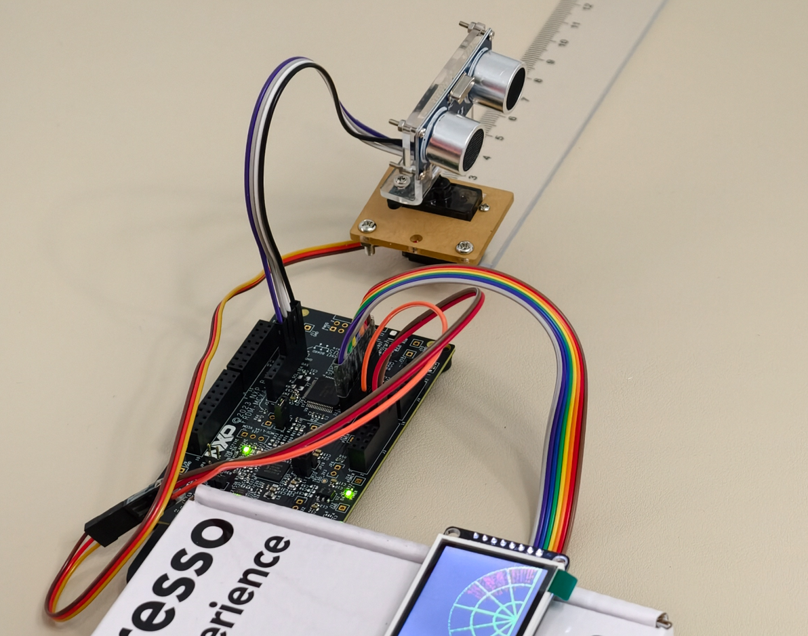

# 接线与引脚定义

所有信号定义以 `boards/frdm_mcxa153.overlay` 为准，本表与其一一对应。

## 引脚总表

| 功能 | 引脚 | 说明 |
| :--- | :--- | :--- |
| HC-SR04 Trig | P3_28 | GPIO 输出，12 µs 触发脉冲 |
| HC-SR04 Echo | P3_27 | GPIO 输入，下拉，双边沿中断——**5 V 电平，必须先分压再接** |
| 舵机 PWM | P3_9 | FlexPWM0 SM1 B1，50 Hz，500–2500 µs 脉宽 ↔ 0–180°（MG90S/SG90） |
| LCD / 字库 SCK / MOSI / MISO | P1_1 / P1_0 / P1_2 | LPSPI0 |
| **共享片选** | **P1_3** | **物理低 = ST7735，物理高 = GT20L 字库（经反相器）** |
| LCD DC | P3_30 | 数据/命令选择 |
| LCD 背光 | P3_1 | 高电平点亮 |
| 量程按键（SW2） | P3_29 | 板载按键，别名 `range-btn`；运行中循环切换 30/60/100/200 cm |
| 暂停按键（SW3） | P1_7 | 板载按键，别名 `sw0` 重映射到 `user_button_3` |
| 温度传感器 | 板载 P3T1755DP | I3C，Zephyr 原生 `nxp,p3t1755` 驱动，7 位地址 0x48 |

实际接好的样子（彩虹排针是屏，紫灰两根是超声波，舵机单独一组线）：

## 共享片选约定（重要）

LCD 模组上 ST7735 与 GT20L16S1Y 字库 ROM 共用一根物理片选线 P1_3，由模组上的反相器拆分成两路：

- **P1_3 = 低** → 选中 ST7735。overlay 中 `cs-gpios = <&gpio1 3 GPIO_ACTIVE_LOW>`，由显示驱动自动控制；
- **P1_3 = 高** → 选中字库 ROM。`font_chip.c` 的别名声明为 `GPIO_ACTIVE_HIGH`，并在每次读操作前后显式驱动该线。

因此 `font_chip.c` **不使用** SPI 自动片选（`spi_config.cs` 保持零初始化）：`get_n_bytes_from_rom()` 手动包围整个 `0x03 + 24 位地址 + N 字节`事务，保证 ROM 在完整传输期间保持选中，且所有错误路径都会把线恢复到 LCD 安全态（低电平）。

> 任何写着 LCD_CS / ZK_CS 两根独立片选的旧文档都已过时。

## 电气注意事项

- **HC-SR04 Echo 是 5 V 电平。** 接 P3_27 之前必须电阻分压（如 10k+10k）或电平转换，或者直接使用 3.3 V 兼容的 HC-SR04P。不要指望用软件绕过这个问题。
- **舵机供电**：MG90S/SG90 必须由合适的外部 5 V 电源供电，并与开发板共地。舵机启动/堵转电流会把 MCU 拉到欠压复位。
- SPI 飞线尽量短；若舵机负载下屏幕出现干扰，可在 SCK/MOSI 串约 33 Ω 电阻，并让舵机电源线与 SPI 线束分开走。

## 显示屏点亮笔记（2026-09 修复记录）

- 这块 1.8" ST7735S 屏**必须**配置 `inversion-on;`——缺省时驱动发 INV_OFF，整屏噪点/发白；
- `mipi-max-frequency` 限制在 **8 MHz**（15 MHz 时飞线振铃导致花屏）；调试时可降到 4/2 MHz；
- 屏参数：160×128，`madctl 0x60`，`colmod 0x55`，完整电源控制与伽马表见 overlay。

## 舵机方向

如果物理扫描方向与屏幕扫描线方向相反，翻转 `src/main.c` 中的 `SERVO_ANGLE_REVERSED`（0/1）即可。

---

## English Summary

Authoritative pinout lives in `boards/frdm_mcxa153.overlay`: Trig P3_28, Echo P3_27 (dual-edge IRQ, **5 V — level-shift first**), servo PWM P3_9 (FlexPWM0 SM1 B1, 50 Hz, 500–2500 µs), LPSPI0 on P1_1/P1_0/P1_2, LCD DC P3_30, backlight P3_1, SW2 P3_29 (range), SW3 P1_7 (pause), on-board P3T1755DP over I3C at 0x48. **Shared chip-select**: one physical line P1_3 serves both the ST7735 (low, driven by the display driver via `cs-gpios`) and the GT20L font ROM (high, via an on-module inverter, driven manually by `font_chip.c` around each transaction with all error paths returning the line low). Power the servo from an external 5 V supply with common ground; keep SPI fly wires short or add ~33 Ω series resistors. The panel requires `inversion-on;` and SPI ≤ 8 MHz. Flip `SERVO_ANGLE_REVERSED` in `src/main.c` if the sweep direction is mirrored.
